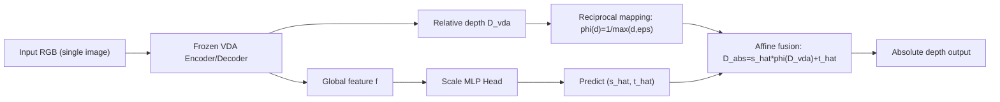

# VDA-Absolute-Depth-Distillation

基于 Video Depth Anything (VDA) 的绝对深度蒸馏工程。  
该仓库将原始“视频相对深度”能力改造为“单图输入 + 物理尺度输出”的流程，用于稳定地生成绝对深度结果并支持时序对比分析。

## 1. 项目目标

- 保留 VDA 的边缘与相对几何表征能力。
- 使用 Depth Pro 作为绝对深度教师信号。
- 通过轻量 `Scale MLP Head` 预测每帧尺度参数。
- 当前映射采用倒数后线性仿射：
  `D_abs = s * (1 / max(D_vda, eps)) + t`

## 2. 项目图示

### 2.1 知识蒸馏架构图


### 2.2 端到端流程图



## 3. 核心目录

```text
VDA-Absolute-Depth-Distillation/
├── VDA_Absolute_Distillation/
│   ├── configs/distill_config.yaml
│   ├── data_prep/
│   ├── core_engine/
│   ├── models/
│   └── inference_abs_vda.py
├── scripts/
│   ├── make_strategy_compare_4cols_shared_scale.py
│   ├── make_temporal_compare_video.py
│   └── draw_vda_kd_architecture_paper_simple.py
├── docs/
│   ├── Agent_VDA_Absolute_Distillation-CN.md
│   ├── vda_pipeline.md
│   ├── depth_pro_pipeline.md
│   └── output_inventory.md
└── artifacts/
    └── architecture/vda_kd_architecture_paper_simple_clean.png
```

## 4. 环境依赖

推荐在 Linux + CUDA 环境运行，核心依赖：

- `python >= 3.10`
- `torch`
- `opencv-python`
- `numpy`
- `pyyaml`
- `matplotlib`

并确保配置中的外部路径可用（VDA 原仓库、Depth Pro 仓库、数据集路径、权重路径）。

## 5. 快速开始

进入核心工程目录：

```bash
cd VDA_Absolute_Distillation
```

### 4.1 对齐分辨率（可选预处理）

```bash
python data_prep/01_spatial_align.py \
  --config configs/distill_config.yaml
```

### 4.2 提取离线尺度标签 `(s*, t*)`

```bash
python data_prep/02_extract_scale_labels.py \
  --config configs/distill_config.yaml \
  --plot
```

### 4.3 训练尺度头（冻结 VDA 主干）

```bash
python core_engine/train_distill.py \
  --config configs/distill_config.yaml \
  --run-name run_cam00_01_04_05_19_20
```

### 4.4 单图/目录推理绝对深度

```bash
python inference_abs_vda.py \
  --config configs/distill_config.yaml \
  --checkpoint /media/a1/16THDD/YJY/VDA_Absolute_Distillation/runs/run_cam00_01_04_05_19_20/best.pt \
  --input /media/a1/16THDD/XZB/DyNeRF/coffee_martini/images/cam00 \
  --output-dir /media/a1/16THDD/YJY/VDA_Absolute_Distillation/infer/cam00_abs
```

输出包括：

- `*.npy`：绝对深度数组
- `*.jpg`：可视化图
- `metadata.json`：每帧 `scale/shift` 与路径信息

## 6. 对比与时序可视化

仓库 `scripts/` 提供：

- 四列静态对比图（RGB / Depth-Pro / VDA 倒数 / 多场景模型输出）
- 时序视频生成（用于观察帧间稳定性）
- 架构图绘制（论文风格简化版）

示例（时序视频）：

```bash
python scripts/make_temporal_compare_video.py \
  --rgb-dir /path/to/images/cam00 \
  --depth-pro-dir /path/to/raw_depth_pro_depth/cam00 \
  --vda-dir /path/to/raw_vda_depth/cam00 \
  --pred-dir /path/to/abs_pred/cam00 \
  --output-video /path/to/out/compare_cam00.mp4 \
  --output-metrics /path/to/out/compare_cam00_metrics.json
```

## 7. 关键约束

- 默认只使用白名单相机目录；`cam02` 为空目录，应显式跳过。
- VDA 与 Depth-Pro 分辨率不一致时，需先做空间对齐或在流程中插值对齐。
- 单图改造后仍需满足 `ensure_multiple_of=14` 的 patch 约束。
- 训练阶段冻结 VDA 主干与解码器，仅更新 `Scale MLP Head`。

## 8. 文档索引

- 项目规则与边界：`VDA_Absolute_Distillation/PROJECT_CHARTER_AND_GUIDELINES.md`
- 技术状态记录：`VDA_Absolute_Distillation/TECHNICAL_STATUS_2026-03-25.md`
- 总结报告（中文）：`docs/Agent_VDA_Absolute_Distillation-CN.md`

## 9. 许可证

本仓库沿用 `LICENSE` 中的许可条款；如使用第三方模型与权重，请同时遵循其原始许可证。
